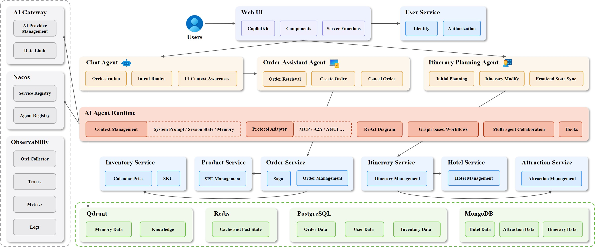

# TripSphere

## Overview

This monorepo contains TripSphere, an AI-native distributed system. It simulates an online travel platform where AI agents incorporate with complex business workflows, orchestrating and composing backend capabilities across services to fulfill end-to-end tasks.



## Motivation

Agentic AI is moving beyond isolated, lightweight tasks into real business systems, where planning and execution are shaped by business rules, service boundaries, system state, and infrastructure constraints. TripSphere is built as a full-stack AI-native benchmark and testbed for studying this deeper integration, providing an open environment for exploring how agents interact with complex workflows, heterogeneous services, and dynamic runtime conditions.

## Deployment

### Docker Compose

#### 1. Environment Configuration

Copy the example environment file to `.env` file:

```bash
cp .env.example .env
```

Then, open and edit `.env` to set your environment variables.

#### 2. Build Docker Images

Backend services and agents depend on protobuf and gRPC codes generated from `.proto` files. So before building the Docker images, you need to generate those codes using [Buf](https://buf.build).

For example, if you want to build docker image for `trip-chat-service`, execute the following commands:

```bash
cd trip-chat-service
buf generate
docker build . -t tripsphere/trip-chat-service:latest
```

NOTE: Running `buf generate` too frequently/simultaneously may trigger rate limit from Buf Schema Registry (BSR).

#### 3. Docker Compose Up

When all the service/agent images are built, you can start the system by running the following command:

```bash
docker compose -f deploy/docker-compose/docker-compose.yaml --env-file .env \
  up --force-recreate --remove-orphans --detach
```

After the system is started, you should be able to access `http://<host>:3000` to view the TripSphere frontend.

#### 4. Configure AI Gateway

First, access the Higress console `http://<host>:8001`. You will be prompted to set the admin password on first access.

Then, add an AI service provider. Go through "AI Gateway Config" -> "LLM Provider Management" -> "Create AI Service Provider". Select your LLM provider (OpenAI/OpenAI Compatible, Google Gemini, etc.) and enter the real API key and (optionally) a custom base URL.

After adding the provider, go through "AI Gateway Config" -> "AI Route Config" -> "Create AI Route". Map your path prefix, e.g. `/v1`, to the target provider you just configured. To verify the AI route, send a test request using the command below:

```bash
curl -sv http://<host>:28080/v1/chat/completions \
    -X POST \
    -H 'Content-Type: application/json' \
    -d \
      '{
        "model": "<model-name>",
        "messages": [
          {
            "role": "user",
            "content": "Hello!"
          }
        ]
      }'
```

You should see the response from the AI provider. All AI-enabled services connect to Higress at `http://higress:8080/v1` inside the Docker network.

### Kubernetes

Coming soon.

## Development

### Prerequisites

[Buf](https://buf.build/) is required to generate protobuf and gRPC codes. Optionally install [Task](https://taskfile.dev/#/installation) to run grouped tasks defined in `Taskfile.yaml`. You can run `task` to show all available tasks defined in each `Taskfile.yaml`.

### Protobuf and gRPC Codes

Protobuf and gRPC codes are useful to ensure projects can be compiled, and provide hints for IDEs. In each service directory that contains `buf.gen.yaml`, run `buf generate` to generate the codes.

### Toolchain & Environment

- [Bun](https://bun.com/) as JavaScript/TypeScript runtime and package manager
- [uv](https://docs.astral.sh/uv/) as Python package and environment manager (Python 3.12.12)
- Maven Wrapper (`./mvnw`) as Java build and project manager (JDK 21)
- [Go](https://go.dev/) 1.25.6 as Golang project and package manager

### AI Coding Agents

This repository provides built-in guidance for AI coding agents (Cursor, Copilot, Windsurf, etc.) through two mechanisms: **Agent Rules** and **Agent Skills**.

#### Agent Rules

`AGENTS.md` files define repository-level conventions that agents must follow. They are placed at key directories:

- `AGENTS.md` (root) — toolchain requirements (`bun`, `uv`, `./mvnw`) and universal code style guidelines.
- `trip-next-frontend/AGENTS.md` — frontend-specific rules: Next.js 16 conventions, CopilotKit V2 API, ShadcnUI theming, and refactoring workflows.

Agents automatically pick up these rules when working in the corresponding directories.

#### Agent Skills

Skills are modular knowledge packages (under `.agents/skills/`) that teach agents specialized workflows and best practices. We develop this repository under the help of AI Coding Agents equipped with skills like adk-cheatsheet, shadcn, vercel-react-best-practices, etc.

These skills are managed via the [Skills CLI](https://skills.sh/) (see `skills-lock.json`). Run `bunx -b skills ls` to list all installed skills.
