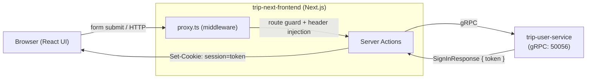

# 认证方案

## 架构概览

采用 **Next.js Server Actions + gRPC 直连 + JWT 无状态会话** 的方案。前端（`trip-next-frontend`）既作为 UI 渲染层，也作为 BFF 层，通过 Server Actions 直接调用后端 `trip-user-service` 的 gRPC 接口，无需额外的 REST API 网关。



## 用户注册（Sign Up）

### 流程

1. 用户在 `/signup` 页面填写 **姓名、邮箱、密码、确认密码**
2. 表单提交后触发 Server Action `signUp`
3. Server Action 使用 Zod 对表单字段做校验（`SignUpFormSchema`）：
   - 姓名：至少 2 个字符
   - 邮箱：有效邮箱格式
   - 密码：至少 8 位，包含字母、数字、特殊字符
   - 确认密码：与密码一致
4. 校验通过后，通过 gRPC 客户端调用 `UserService.SignUp`
5. gRPC 接口成功返回后，重定向到 `/signin` 登录页

### gRPC 接口

```protobuf
rpc SignUp(SignUpRequest) returns (SignUpResponse);

message SignUpRequest {
  string name = 1;
  string email = 2;
  string password = 3;
}

message SignUpResponse {}
```

### 错误处理

| gRPC Status Code   | 用户提示                     |
| ------------------ | ---------------------------- |
| `ALREADY_EXISTS`   | 该邮箱已被注册。             |
| `INVALID_ARGUMENT` | 输入信息无效，请检查后重试。 |
| 其他错误           | 注册失败，请稍后再试。       |

## 用户登录（Sign In）

### 流程

1. 用户在 `/signin` 页面填写 **邮箱、密码**
2. 表单提交后触发 Server Action `signIn`
3. Server Action 使用 Zod 对表单字段做校验（`SignInFormSchema`）：
   - 邮箱：有效邮箱格式
   - 密码：至少 8 位
4. 校验通过后，通过 gRPC 客户端调用 `UserService.SignIn`
5. User 服务验证凭证，返回 `SignInResponse`（包含 `user` 信息和 JWT `token`）
6. BFF 调用 `createSession(token)`：
   - 使用 RS256 公钥（`JWT_PUBLIC_KEY` 环境变量）验证 token 合法性
   - 从 JWT payload 中解析出 `userId`、`name`、`email`、`roles`、`expiresAt`
   - 将 token 写入 cookie（名称：`session`），配置如下：
     - `httpOnly: true` — 防止 XSS 读取
     - `secure: false` — 开发环境不强制 HTTPS
     - `sameSite: "lax"` — 防 CSRF
     - `path: "/"` — 全站可用
     - `expires` — 与 JWT 过期时间一致
7. 登录成功后重定向到首页 `/`

### gRPC 接口

```protobuf
rpc SignIn(SignInRequest) returns (SignInResponse);

message SignInRequest {
  string email = 1;
  string password = 2;
}

message SignInResponse {
  User user = 1;
  string token = 2;  // JWT token
}
```

### 错误处理

| gRPC Status Code   | 用户提示                     |
| ------------------ | ---------------------------- |
| `UNAUTHENTICATED`  | 邮箱或密码错误。             |
| `NOT_FOUND`        | 邮箱或密码错误。             |
| `INVALID_ARGUMENT` | 输入信息无效，请检查后重试。 |
| 其他错误           | 登录失败，请稍后再试。       |

## 退出登录（Sign Out）

### 流程

1. 用户在导航菜单中点击「退出登录」
2. 触发 Server Action `signOut`
3. 调用 `deleteSession()`，清除 `session` cookie
4. 重定向到 `/signin`

## 会话管理（Session）

### JWT 验证

使用 `jose` 库进行 JWT 验证，算法为 **RS256**（非对称加密）：

- **公钥来源**：环境变量 `JWT_PUBLIC_KEY`（PEM 格式的 SPKI 公钥）
- **签发方**：`trip-user-service`（持有私钥）
- 公钥会懒加载并缓存，仅首次调用 `importSPKI` 一次

### SessionPayload 结构

从 JWT payload 中解析出的会话信息：

```typescript
type SessionPayload = {
  userId: string;   // JWT sub
  name: string;     // JWT name claim
  email: string;    // JWT email claim
  roles: string[];  // JWT roles claim
  expiresAt: Date;  // JWT exp (unix seconds → Date)
};
```

### 关键函数

| 函数            | 说明                                                         |
| --------------- | ------------------------------------------------------------ |
| `createSession` | 验证 token 并写入 `session` cookie                           |
| `getSession`    | 从 cookie 中读取 token 并验证，返回 `SessionPayload \| null` |
| `getToken`      | 仅读取 cookie 中的原始 token 字符串                          |
| `verifyToken`   | 使用 RS256 公钥验证 JWT，返回解析后的 `SessionPayload`       |
| `deleteSession` | 删除 `session` cookie                                        |

## 路由保护（Middleware / Proxy）

通过 `proxy.ts`（Next.js Middleware 模式）实现请求级别的路由保护和用户信息注入：

### 路由规则

| 路由类别     | 路径                               | 行为                               |
| ------------ | ---------------------------------- | ---------------------------------- |
| 仅游客可访问 | `/signin`、`/signup`               | 已登录用户访问时重定向到 `/`       |
| 需要认证     | `/order`、`/profile`、`/itinerary` | 未登录用户访问时重定向到 `/signin` |
| 公开         | 其他路径                           | 无限制                             |

### Header 注入

Middleware 会在每个请求中：

1. **剥离**客户端发送的 `x-user-id`、`x-user-roles`、`authorization` header（防止伪造）
2. 如果用户已登录（cookie 中的 JWT 验证通过），**注入**以下 header 到服务端请求中：
   - `x-user-id` — 用户 ID
   - `x-user-roles` — 用户角色（逗号分隔）
   - `authorization` — `Bearer <token>`

这些 header 会被 `getAuthMetadata()` 读取，转化为 gRPC Metadata 传递给各后端微服务。

## UI 层会话状态

### SiteHeader

`SiteHeader`（服务端组件）调用 `getSession()` 获取会话状态：

- **已登录**：显示 `UserNavigationMenu`（头像 + 用户名 + 下拉菜单）
- **未登录**：显示「登录」与「注册」按钮

### UserNavigationMenu

客户端组件（通过 `dynamic` + `ssr: false` 加载以避免 Hydration 不匹配），接收 `SessionPayload` 作为 props，展示：

- 用户头像（基于姓名生成的 DiceBear 头像）
- 用户名
- 下拉菜单：个人中心、账户设置、退出登录

## 关键文件索引

| 文件路径                              | 职责                                      |
| ------------------------------------- | ----------------------------------------- |
| `actions/auth.ts`                     | Server Actions：signUp / signIn / signOut |
| `lib/session.ts`                      | 会话管理：JWT 验证、Cookie 读写           |
| `lib/definitions.ts`                  | 表单校验 Schema、类型定义                 |
| `lib/grpc/client.ts`                  | gRPC 客户端工厂 + Auth Metadata 构建      |
| `proxy.ts`                            | Middleware：路由保护 + Header 注入        |
| `components/signin-form.tsx`          | 登录表单组件                              |
| `components/signup-form.tsx`          | 注册表单组件                              |
| `components/user-navigation-menu.tsx` | 已登录用户导航菜单                        |
| `components/site-header.tsx`          | 站点顶栏（含登录态判断）                  |
| `app/(auth)/signin/page.tsx`          | 登录页面                                  |
| `app/(auth)/signup/page.tsx`          | 注册页面                                  |
