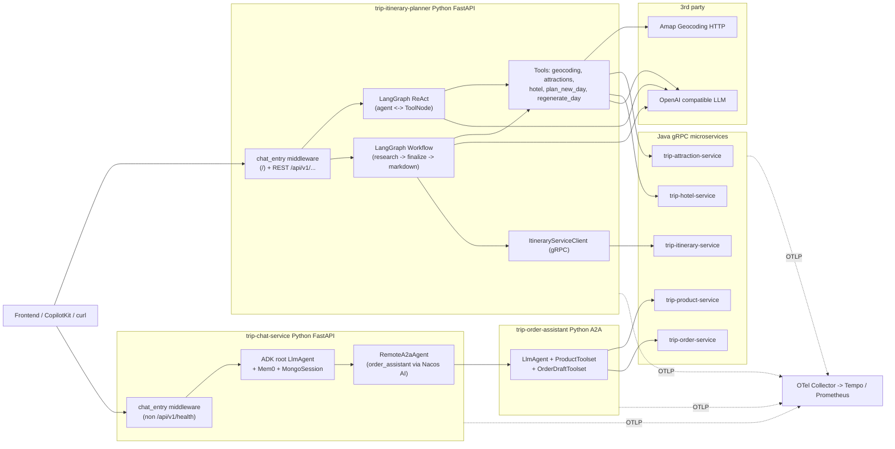

# 面向 LangGraph 智能体的应用层故障注入设计报告

> 报告对象：TripSphere AI 原生应用（`trip-itinerary-planner` + `trip-chat-service` + 周边 Java gRPC 微服务）
> 配套北极星：`docs/aim.md`
> 关键词：LangGraph、应用层故障注入、低侵入插桩、可复现实验、OpenTelemetry、Chaos Mesh
> 版本：v1（设计稿，不含代码实现）

---

## 0. 摘要与北极星对齐

`docs/aim.md` 将 TripSphere 定位为"面向 LangGraph 智能体的 AI 原生应用层故障注入靶场"，要求每项工作至少满足 **故障注入**、**可靠性验证**、**实验可复现** 三者之一，并以低侵入插桩、配置化注入、可观测闭环为执行护栏。本报告在不改动业务代码的前提下：

1. 还原 TripSphere 当前 AI 原生应用的真实运行结构，沉淀 **三条具有不同故障语义的长调用链**；
2. 基于代码现状，给出 **应用层 error 故障分类体系**，并将每类故障精确绑定到代码内的注入点（函数 / Span / RPC 边界）；
3. 设计 **声明式、可复现、可观测** 的注入控制面与数据面，复用仓库已存在的 `experiment_id` / `fault_scenario` 头与 OTel `rpc_span` / `tool_span` / `chat_turn_span`；
4. 给出 **指标体系、证据链、实验记录模板**，让"故障注入 + 可观测"形成闭环；
5. 沉淀一份 **三阶段实验矩阵与执行手册**，可直接驱动实验落地与论文实证章节。

本报告为后续实现的"设计基线"。代码落地时遵循：能用插桩开关就不改业务、能在 `tracing.py` 周围扩展就不动 LangGraph 主路径。

---

## 1. 概念边界与现有可观测能力

### 1.1 应用层故障 vs 资源层故障

| 维度 | 资源层（Chaos Mesh / Litmus） | 本报告聚焦的应用层 |
|------|----------------------------|------------------|
| 注入对象 | Pod、网络、磁盘、CPU、JVM | LangGraph 节点、Tool 调用、记忆 / 状态、LLM 输出、跨 Agent A2A |
| 故障语义 | "网络抖动"、"Pod 崩溃" | "工具超时"、"记忆篡改"、"模型幻觉"、"结构化输出失败" |
| 影响半径 | 整个进程 / Pod | 单一调用、单条会话、单个工具、单个实验 ID |
| 表达介质 | CRD / iptables / cgroup | 装饰器开关 + 请求头/上下文 + Span 属性 |
| 与 Trace 关系 | 多为"事后关联" | 注入即埋点，注入参数与结果直接落到 Span |

应用层注入的关键价值：在 **不破坏服务运行时** 的情况下，可针对某条 trace、某个工具、某个 Agent turn 精确制造异常，配套 OTel Trace 形成 "故障声明 → 触发证据 → 系统响应 → 评估结论" 的最短闭环。

### 1.2 仓库已具备的"故障注入半成品"

代码勘察显示，仓库 **已经把"实验 / 故障"作为一等公民贯穿到了观测面**，这是设计的最大利好：

- 入口侧：`trip-itinerary-planner` 在 `chat_entry_observability_middleware` 里把 `x-experiment-id` / `x-fault-scenario` 透传到 `chat.entry` Span；`trip-chat-service` 在 `make_extract_headers` 里同样抽取。
- LangGraph 内部：`experiment_attributes()` 在 `chat_turn_span`、`tool_span`、`rpc_span` 都会注入 `experiment.id` / `fault.scenario`。
- gRPC 边界：`_grpc_metadata` 把 `x-experiment-id` / `x-fault-scenario` 同时写到 gRPC metadata，并通过 `inject_trace_context` 携带 W3C trace。
- A2A 边界：`build_a2a_metadata` 把同样的字段透传到远端 `order_assistant`，并 `enrich_current_span_with_experiment` 标记当前 Span。

**结论**：实验主键 `experiment_id` 与故障维度 `fault_scenario` 已经具备从前端→FastAPI→LangGraph→Tool→gRPC→A2A 的端到端透传链。本报告的注入设计不需要新增控制平面协议，只需要在已有 Span 边界引入"开关 + 注入逻辑"。

### 1.3 现存容错与降级（基线行为，必须先识别再建模）

| 路径 | 现有 Fallback | 行为 |
|------|---------------|------|
| `research_and_plan` 地理编码失败 | 默认上海坐标 `(121.4737, 31.2304)` | 不抛错，继续后续节点 |
| `research_and_plan` 景点搜索失败 | `attractions = []`，文案"No specific attractions found" | LLM 仍生成（**幻觉风险点**） |
| `research_and_plan` 酒店搜索失败 | `hotel_details = []` | 跳过住宿活动 |
| `research_and_plan` 结构化 LLM 失败 | 空 `day_plans` + 通用 highlights，再次按目的地中心搜酒店 | 行程"骨架空" |
| `generate_markdown` LLM 失败 | `_build_fallback_markdown` 拼装 | 文案降级 |
| `agent_node` LLM 失败 | 记录 Span 异常并 **抛出** | 用户面看到错误 |
| `plan_new_day` Tool | `fallback_reasons` 列表（attraction_service_error / hotel_service_error / llm_plan_error / template_from_attractions / no_plan_candidates） | 已有完善的 outcome 标签 |
| `regenerate_day` Tool | 景点搜索失败 → 通用文案；LLM 失败 → `_ok` 错误信息 | 不更新行程 |
| `_update` Tool helper | `itinerary.id` 为空时拒绝写入 | 防止前端未同步覆盖 |
| `plan_itinerary` 持久化失败 | HTTPException 502 | 整请求失败 |

故障注入实验设计必须 **以这些基线行为为对照组**：注入应使被观测指标相对基线发生显著偏离，否则等价于无效实验。

---

## 2. 系统架构与三条长调用链

### 2.1 总体架构



### 2.2 链路 A — REST 规划链（可端到端写库的"主长链"）

**用例**：用户提交目的地 + 日期 + 偏好，期望同步拿到行程并 **强一致** 写入 itinerary 库。

| # | 步骤 | 代码位置 | 说明 |
|---|------|----------|------|
| 1 | HTTP 入口 `POST /api/v1/itineraries/plannings` | `routers/planning.py` `plan_itinerary` | 经 `provide_current_user_id`（`x-user-id`） |
| 2 | 编排入口 | `routers/planning.py` `_workflow.ainvoke(initial_state)` | `_workflow = create_planning_workflow()` |
| 3 | 节点 1 — 调研 | `agent/nodes.py` `research_and_plan` | 内部 4 段 IO + LLM |
| 3a | 高德地理编码 | `tools/geocoding.py` `geocoding_tool.ainvoke` | HTTP `restapi.amap.com`，`rpc_span("AmapGeocoding", "v3.geocode.geo")` |
| 3b | 景点 gRPC | `tools/attractions.py` `search_attractions_nearby` | Nacos → `AttractionService.GetAttractionsNearby` |
| 3c | 结构化 LLM | `chat_model.with_structured_output(CompleteItineraryPlan)` | 直接调 OpenAI 兼容端点 |
| 3d | 酒店 gRPC | `tools/hotel.py` `search_hotels_nearby` | Nacos → `HotelService.GetHotelsNearby` |
| 4 | 节点 2 — 组装 | `agent/nodes.py` `finalize_itinerary` | 纯本地，活动坐标匹配回填 |
| 5 | 节点 3 — Markdown | `agent/nodes.py` `generate_markdown` | 再次 `chat_model.ainvoke` |
| 6 | 持久化 gRPC | `grpc/clients/itinerary.py` `ItineraryServiceClient.create_itinerary` | `rpc_span("ItineraryService", "CreateItinerary")` |
| 7 | 返回 | 用 `saved.id` 覆盖本地 id，返回 `PlanItineraryResponse` | |

**链路特征**：

- 长度：1 入口 → 3 LangGraph 节点 → 3 远程 IO + 2 LLM → 1 gRPC 持久化。
- 一致性：节点 1、2 失败有降级（默认坐标 / 空候选 / 通用 highlights），但 **第 6 步失败直接 502**。
- 观测信号：高德 / Attraction / Hotel / Itinerary 都有 `rpc_span`；LangChain 自动 Span 由 `LangChainInstrumentor` 提供。
- **重要缺口**：`plan_itinerary` 调用 `create_itinerary` 时 **没有传 `headers`**，导致 HTTP 入口的 `x-experiment-id` / `x-fault-scenario` 无法传到 itinerary gRPC metadata。这是注入实验落地前需要先补齐的"管道"。

### 2.3 链路 B — CopilotKit ReAct 对话链（多轮、跨工具迭代）

**用例**：前端 CopilotKit 会话，用户在已有 `itinerary` 上反复修改、新增天数、再生成某天。

| # | 步骤 | 代码位置 | 说明 |
|---|------|----------|------|
| 1 | HTTP `POST /` | `asgi.py` `chat_entry_observability_middleware`（仅 `/`）+ `add_langgraph_fastapi_endpoint(...)` | 入口 Span 含 `experiment.id` / `fault.scenario` |
| 2 | LangGraph 编译 | `agent/chat_agent.py` `create_chat_graph(nacos_naming)` | `MemorySaver` checkpoint |
| 3 | Agent turn | `agent_node` | `chat_turn_span` + `_turn_attributes_from_config`（含 `chat.thread.id`、`chat.frontend_tool_count`、`chat.backend_tool_count`） |
| 4 | LLM | `model_with_tools.ainvoke(conversation, config)` | 失败抛出（无 fallback 回复） |
| 5 | 路由决策 | `should_continue` | 仅 backend 工具进 `ToolNode`，前端工具走 AG-UI |
| 6 | 工具执行 | `ToolNode(backend_tools)` | 包含：`geocoding_tool`、`update_itinerary_day`、`add_activity`、`remove_spot`、`delete_day`、`add_day`、`update_markdown`、`plan_new_day`、`regenerate_day` |
| 7a | `plan_new_day` | `tools/itinerary.py` | `tool_span("plan_new_day")` + 内部 attractions/hotels gRPC + LLM；丰富的 `tool.outcome` / `tool.fallback_reason` 维度 |
| 7b | `regenerate_day` | `tools/itinerary.py` | 同上但更聚焦景点 |
| 8 | 状态写回 | `Command(update={"itinerary": _recompute_summary(...)})` | `_keep_itinerary` reducer 防止空覆盖；`_update` 拒写无 id 行程 |
| 9 | AG-UI StateSnapshotEvent | `ag_ui_langgraph` | 推送给前端 |

**链路特征**：

- 长度：单 turn 内部即可触发 6+ Span；多轮对话累积时单条 trace 可达数十个 Span。
- 状态层：`MemorySaver` 进程内 checkpoint + AG-UI 双向同步。
- 注入价值：可针对"`itinerary` 状态字段被篡改"、"`pending_day_plan` 草案丢失"、"`should_continue` 路由错误"等做专门实验。
- 观测信号最完整：`chat.thread.id` + `chat.turn.outcome` + `chat.llm.latency_ms` + `llm.usage.*` + 工具的 `tool.outcome` / `tool.fallback_reason`。

### 2.4 链路 C — Chat → A2A → Order 跨服务长链

**用例**：用户在主聊天里说"帮我下单某 SKU"，根 Agent 委托给远程子 Agent `order_assistant`，子 Agent 依次调 product / order gRPC 完成下单。

| # | 步骤 | 代码位置 | 说明 |
|---|------|----------|------|
| 1 | HTTP 入口 | `trip-chat-service/asgi.py` `chat_entry_observability_middleware`（非 health） | 抽取 `x-experiment-id` / `x-fault-scenario` 等 |
| 2 | ADK 启动 | `_init_adk_app` → `RemoteAgentsFactory.get_remote_agents()` | `NacosAI.get_agent_card("order_assistant")` |
| 3 | 远端解析 | `agent/remote_agent.py` `_resolve_remote_agent` | 失败返回 `None`，子 Agent 缺失 |
| 4 | 主 Agent 决策 | ADK 根 `LlmAgent`（LiteLLM + Mem0 + MCP weather + load_memory_tool） | `LiteLLMInstrumentor` / `GoogleADKInstrumentor` 自动 Span |
| 5 | A2A 委托 | `RemoteA2aAgent`（ADK） | `a2a_request_meta_provider` → `build_a2a_metadata`（含 W3C `inject`） |
| 6 | 远端入口 | `trip-order-assistant/agent.py` `before_agent_callback` | 把 A2A metadata 写入 `state["headers"]` |
| 7 | Product Tool | `ProductToolset.get_sku_by_id` / `get_spu_by_id` | Nacos → `ProductService.GetSkuById` |
| 8 | 订单草稿 | `OrderDraftToolset.create_order_draft` | 写进程级 `ORDER_DRAFTS` 字典 |
| 9 | 提交 | `submit_order_draft` → `OrderService.CreateOrder` | `rpc_span("order", "CreateOrder")` |

**链路特征**：

- 跨进程 / 跨语言（Python A2A → Java gRPC）。
- 状态：`ORDER_DRAFTS` **进程级内存字典**，多副本 / 重启即丢；这是天然的"状态故障"实验对象。
- 远端解析点：`NacosAI.get_agent_card` 失败、`RemoteA2aAgent` 实例化失败可造成"子 Agent 整个消失"，是一类与单服务链截然不同的故障语义。
- 实验关联：`build_a2a_metadata` 已经把 `experiment_id` / `fault_scenario` 透传到远端 `state["headers"]`，与本地 Span 自然对齐。

### 2.5 三条链路共性与差异

| 维度 | 链路 A | 链路 B | 链路 C |
|------|--------|--------|--------|
| 编排引擎 | LangGraph 线性图 | LangGraph ReAct 循环 | Google ADK + A2A |
| 状态主体 | 单次 `PlanningState` | `MemorySaver` checkpoint + `itinerary` 状态字段 | `ORDER_DRAFTS` 进程字典 + ADK Session |
| 终态副作用 | gRPC 写库 | 状态变更 + 前端推送（不写库） | gRPC 写订单 |
| 失败可见性 | HTTP 状态码 + 502 | Span error + 用户感知 | 远端 RPC 错误码 + 草稿不一致 |
| Trace 边界 | 单 service | 单 service | 跨 3 service |
| 已有 Fallback 密度 | 高（每节点都有） | 中（工具有，agent 无） | 低（远端不可用即失败） |
| 注入价值 | 持久化 + LLM 结构化 | 长循环 + 状态 | 跨服务 + 远端 Agent |

---

## 3. 应用层 error 故障分类模型

### 3.1 分类总览

将"应用层故障"按 **故障所属层** × **故障性质** 二维交叉，得到下表。每条故障都对应明确的代码注入点与可观察后果。

| 编号 | 类别 | 故障性质 | 典型注入点 | 系统预期反应 |
|------|------|---------|----------|-----------|
| F1 | 工具 / RPC 延迟注入 | 时间维度（高延迟、慢响应） | `geocoding_tool`、`search_attractions_nearby`、`search_hotels_nearby`、`ItineraryServiceClient.*`、A2A 调用 | 触发上游超时、放大 LLM token 等待 |
| F2 | 工具 / RPC 异常注入 | 错误维度（抛异常） | 同上 + `ChatOpenAI.ainvoke` | 触发现有 `try/except` 降级或 502 |
| F3 | gRPC 错误码注入 | 错误维度（结构化错误） | `stub.*` 调用前抛 `grpc.aio.AioRpcError` | 测试错误码分类与重试策略缺口 |
| F4 | 服务发现失败 | 拓扑维度 | `NacosNaming.get_service_instance`、`NacosAI.get_agent_card` | 远端整体不可达 / 远程 Agent 失踪 |
| F5 | LLM 输出篡改 | 数据维度（结构化输出腐化） | `structured_llm.ainvoke`（`research_and_plan` / `plan_new_day` / `regenerate_day`） | 验证 Pydantic 校验、活动坐标回填 |
| F6 | LLM 幻觉模拟 | 模型行为维度 | `chat_model.ainvoke` 返回构造内容 | 候选为空时仍生成、生成不存在的目的地 |
| F7 | 工具响应数据篡改 | 数据维度（成功响应腐化） | 在 `geocoding_tool` / `search_attractions_nearby` 返回前篡改 | 验证下游使用错误坐标的影响半径 |
| F8 | 状态 / 记忆篡改 | 状态维度 | `_keep_itinerary` reducer、`pending_day_plan`、`MemorySaver`、Mem0 `AsyncMemory` | 验证状态防御机制（如 id 校验） |
| F9 | 路由决策扰动 | 控制流维度 | `should_continue` 强制走 `__end__` 或强制走 `tools` | 验证 ReAct 循环的稳健性 |
| F10 | A2A / Remote Agent 异常 | 跨服务维度 | `RemoteA2aAgent.*`、`a2a_request_meta_provider` | 验证子 Agent 不可用时主 Agent 行为 |
| F11 | 持久化失败注入 | 一致性维度 | `ItineraryServiceClient.create_itinerary`、`OrderService.CreateOrder` | 测试用户面错误提示与数据一致性 |
| F12 | 部分成功 / 截断 | 数据维度 | `attractions_pb2` 列表只返回 N 条、Markdown 截断 | 验证下游对部分结果的处理 |

### 3.2 故障原语统一描述

每个故障实例都用 **同一套原语字段** 描述（这也是后续注入控制面的 schema 草案）：

```yaml
fault:
  id: "F1.geocoding.latency"          # 全局唯一注入点 ID
  target:
    chain: "A"                         # A | B | C
    component: "tool"                  # tool | rpc | llm | route | state | agent
    location: "geocoding_tool"         # 函数 / Span 名
  primitive: "latency"                 # latency | exception | grpc_error
                                       # | mutate_response | mutate_state
                                       # | force_route | drop_remote
  params:                              # 因 primitive 而异
    delay_ms: 8000
    jitter_ms: 500
    probability: 1.0                   # 0.0~1.0
    duration_s: 60                     # 实验窗口
  scope:
    experiment_id: "exp-2026-04-tool-timeout-01"
    match_headers:                     # 命中条件（任一匹配生效）
      x-experiment-id: "exp-2026-04-tool-timeout-01"
  recovery:
    type: "ttl"                        # ttl | manual | trace_boundary
    ttl_s: 300
```

### 3.3 故障到链路的精确绑定

下表把 §3.1 的 12 类故障落到 §2 的三条链路，给出 **代码位置粒度** 的注入点（这些函数 / 调用都已存在 Span，是天然的"插桩腰部"）。

#### 3.3.1 链路 A — REST 规划链

| 故障 | 注入点（函数 / Span） | 代码 | 预期效果 |
|------|---------------------|------|---------|
| F1 高德高延迟 | `geocoding_tool` 的 `client.get` 之前 | `tools/geocoding.py` | 走 except → 默认上海坐标，整链路成功率不变但首节点延迟显著 |
| F1 景点 gRPC 高延迟 | `search_attractions_nearby` 的 `stub.GetAttractionsNearby` | `tools/attractions.py` | 走 except → `attractions=[]`，激活"无候选幻觉"路径 |
| F2 酒店 gRPC 异常 | `search_hotels_nearby` 抛 `RuntimeError` | `tools/hotel.py` | 走 except → `hotel_details=[]`，住宿活动消失 |
| F3 Itinerary gRPC `UNAVAILABLE` | `ItineraryServiceClient.create_itinerary` 在 `await stub.CreateItinerary` 前抛 `grpc.aio.AioRpcError(StatusCode.UNAVAILABLE)` | `grpc/clients/itinerary.py` | HTTP 502 + Span error，**直接验证强一致性失败用户面** |
| F5 结构化 LLM 输出腐化 | `structured_llm.ainvoke` 注入校验失败的 dict | `agent/nodes.py` | `research_and_plan` 走 except → 空 day_plans + 通用 highlights |
| F6 Markdown 幻觉 | `chat_model.ainvoke` 返回包含错别目的地的文案 | `agent/nodes.py` `generate_markdown` | 验证下游有无校验机制 |
| F7 高德响应篡改 | `geocoding_tool` 中 `response.json()` 之后篡改 location | `tools/geocoding.py` | 整条链使用错误坐标 |
| F11 持久化失败 | 同 F3，但模拟 `INTERNAL` / 超时 | `grpc/clients/itinerary.py` | 触发上游 502 与 Span 错误链 |
| F12 景点截断 | `search_attractions_nearby` 仅返回 1 条 | `tools/attractions.py` | LLM 候选不足，行程质量下降 |

#### 3.3.2 链路 B — ReAct 对话链

| 故障 | 注入点 | 代码 | 预期效果 |
|------|--------|------|---------|
| F2 LLM 异常 | `agent_node` 中 `model_with_tools.ainvoke` | `agent/chat_agent.py` | 当前会**直接抛出**，验证用户面降级缺口 |
| F5 LLM 工具调用参数篡改 | `agent_node` 的 `response.tool_calls` 在写回前修改 | `agent/chat_agent.py` | 模拟"模型把 day=2 错填为 day=3" |
| F6 ReAct 死循环幻觉 | LLM 返回反复无效 `tool_calls` | `agent/chat_agent.py` | 验证 `should_continue` 与最大 turn 限制 |
| F8 `itinerary` 状态字段篡改 | `_keep_itinerary` reducer 包装层 | `agent/chat_agent.py` | 模拟"id 被前端清空"，验证现有防御 |
| F8 `pending_day_plan` 丢失 | 在 `plan_new_day` 写回前置空 | `tools/itinerary.py` | `add_day` 走 `missing_pending_day_plan` 拒绝路径 |
| F9 路由强制 `__end__` | 在 `should_continue` 装饰层强制返回 `__end__` | `agent/chat_agent.py` | 工具被跳过，对话提前结束 |
| F1 工具内 gRPC 高延迟 | `plan_new_day` 内 `search_attractions_nearby` | `tools/itinerary.py` | 走 except → `attraction_service_error` outcome |
| F2 工具内 LLM 异常 | `plan_new_day` 内 `structured_llm.ainvoke` | `tools/itinerary.py` | 走 `llm_plan_error` outcome，触发 template 兜底 |
| F12 候选截断 | `plan_new_day` 内景点候选只保留 1 条 | `tools/itinerary.py` | 验证 `template_from_attractions` 兜底 |

#### 3.3.3 链路 C — A2A 跨服务链

| 故障 | 注入点 | 代码 | 预期效果 |
|------|--------|------|---------|
| F4 远程 Agent 解析失败 | `_resolve_remote_agent` 返回 `None` | `chat/agent/remote_agent.py` | 子 Agent 不进 sub_agents，主 Agent 不会委托 |
| F4 Nacos AgentCard 异常 | `NacosAI.get_agent_card` 抛异常 | 同上 | 同 F4 |
| F1 A2A 高延迟 | `RemoteA2aAgent` 调用前 sleep | ADK `RemoteA2aAgent` | 主 Agent 等待，验证用户感知与 token 浪费 |
| F2 A2A 抛异常 | `a2a_request_meta_provider` 之后注入 | 同上 | 主 Agent 看到子 Agent 失败 |
| F1 Product gRPC 高延迟 | `ProductToolset.get_sku_by_id` 前 sleep | `trip-order-assistant` | 验证下单链整体延迟 |
| F3 Order gRPC 错误码 | `OrderService.CreateOrder` 注入 `FAILED_PRECONDITION` | `trip-order-assistant/tools/order_draft.py` | 草稿存在但提交失败，验证幂等设计 |
| F8 草稿状态丢失 | 提交前清空 `ORDER_DRAFTS` 中目标项 | 同上 | 验证幂等 / 用户错误信息 |
| F10 A2A trace 断链 | `build_a2a_metadata` 跳过 `inject` | `chat/observability/tracing.py` | 验证可观测性回归测试 |

---

## 4. 可复现注入设计

### 4.1 总体架构

```mermaid
flowchart TB
    subgraph control [控制面]
        cm["Chaos Mesh CRD\n或 ConfigMap"]
        registry["FaultRegistry\n(进程内单例)"]
    end
    subgraph data [数据面 - 仓库内已存在的边界]
        header["x-experiment-id\nx-fault-scenario"]
        spans["chat_entry_span / chat_turn_span\ntool_span / rpc_span"]
        deco["@inject_fault 装饰器 / Monkey Patch"]
    end
    subgraph evidence [证据面]
        otel["OTel Trace -> Tempo"]
        metrics["Prometheus metrics"]
        report["实验报告模板"]
    end

    cm --> registry
    header --> registry
    registry --> deco
    deco --> spans
    spans --> otel
    deco -.fault.injected.-> otel
    otel --> report
    metrics --> report
```

设计要点：

1. **控制面声明式**：实验通过 CRD / ConfigMap 声明，仓库进程通过 `FaultRegistry` 周期性拉取（或被 Chaos Mesh Controller 推送），落地为内存中的"匹配规则表"。
2. **数据面靠开关 + 头部命中**：每次请求经由已有 Span 边界进入装饰器，装饰器从 `headers` / `RunnableConfig` / `gRPC metadata` 取出 `x-experiment-id` / `x-fault-scenario`，与 `FaultRegistry` 匹配后再决定是否注入。
3. **证据面零额外协议**：注入行为以 `fault.*` 命名空间的 Span 属性 + Span Event 输出，复用现有 OTel Collector 与 Tempo。

### 4.2 注入开关与命中规则

#### 4.2.1 全局总开关

- 环境变量：`FAULT_INJECTION_ENABLED=true|false`，默认 `false`，生产强烈建议关闭。
- 进程启动时读取一次；运行时如需热切换，可通过 `FaultRegistry.refresh()` 或 SIGHUP。

#### 4.2.2 命中规则

请求 / 调用要被注入，需要 **同时满足**：

1. 全局开关为 true；
2. 请求侧的 `x-experiment-id` 出现在 `FaultRegistry` 的活跃实验列表；
3. 请求侧的 `x-fault-scenario` 命中规则的 `scope.match_headers`；
4. `random.random() < params.probability`。

`x-fault-scenario` 推荐使用紧凑的字符串语义（便于 CRD），例如：

- `tool.geocoding.latency=8000`
- `rpc.itinerary.create.error=UNAVAILABLE`
- `state.itinerary.id=clear`
- `route.should_continue=force_end`
- `agent.order_assistant=drop`

`FaultRegistry` 负责将此字符串解析为 §3.2 的原语对象。这种"短表达式"使得 Chaos Mesh CRD 与 curl 实验都能直接拼接。

#### 4.2.3 作用域

| 作用域 | 适用场景 | 实现 |
|-------|---------|------|
| `request` | 单条 trace | 默认；命中后只影响当前请求 |
| `session` | 一段 ReAct 会话 | 在 `_keep_itinerary` 等 reducer 周边维护 |
| `experiment` | 同 `experiment_id` 的所有请求 | `FaultRegistry` 全局判定 |
| `chain` | 限定链路 | 用入口路径前缀过滤（`/api/v1/itineraries/...`） |

### 4.3 低侵入注入机制（按层）

为遵循 `aim.md` "低侵入 + 配置化" 护栏，按层选择最合适的接入点。**所有改动仅集中在 `observability/tracing.py` 周围与新建 `observability/fault.py`，不改 `nodes.py` / `chat_agent.py` 的核心业务路径。**

#### 4.3.1 工具层（链路 A/B 共用）

- 通过为 `geocoding_tool`、`search_attractions_nearby`、`search_hotels_nearby` 等增加 `@inject_fault("tool.<name>")` 装饰器（在模块加载时打补丁）。
- 装饰器读取上下文中的 headers（来自 `state["copilotkit"]["headers"]` / `RunnableConfig.configurable.headers` / 调用方显式传入），命中后按 primitive 执行。
- 优势：`tool_span` / `rpc_span` 已经在装饰器内部被调用，注入信息直接 `span.set_attribute("fault.injected", True)`。

#### 4.3.2 RPC 层（gRPC 边界）

- 在 `_grpc_metadata` 之后、`stub.<Method>` 之前插入注入点，最简方式是在 `rpc_span` 上扩展一个 `with rpc_span(..., enable_fault=True)`，进入 context 时先按 metadata 决策。
- 错误码注入直接 `raise grpc.aio.AioRpcError(...)` 即可被现有 `record_exception` 捕获，无需调整 except 链。

#### 4.3.3 LLM 层

- 通过对 `langchain_openai.ChatOpenAI.ainvoke` 与 `with_structured_output().ainvoke` 做 Monkey Patch，覆盖 4 个调用点：
  - `agent/nodes.py` 内 `chat_model`
  - `agent/chat_agent.py` 内 `model_with_tools`
  - `tools/itinerary.py` 内 `plan_new_day` / `regenerate_day` 的 `chat_model`
- LLM 注入用同样的 `RunnableConfig` 透传上下文。注入 primitive 包含：`latency`（sleep）、`exception`、`mutate_response`（返回构造内容）、`structured_invalid`（返回不通过 Pydantic 校验的 dict）。

#### 4.3.4 状态 / 路由层（仅链路 B）

- 在 `_keep_itinerary` 之外新增一个 `_with_fault` 包装 reducer，命中后做 `id` 清空 / 部分字段错位等操作。
- 在 `should_continue` 外层加 `route_with_fault(decision_fn)`，根据 `route.should_continue` 故障值返回 `__end__` 或 `tools`。
- 这两个改动是 `agent/chat_agent.py` 的最小改动，但只新增包装、不改原函数体，符合"低侵入"。

#### 4.3.5 跨服务 / A2A 层（链路 C）

- `_resolve_remote_agent` 注入 `agent.<name>=drop` 时直接返回 `None`。
- `RemoteA2aAgent` 调用层做 `latency` / `exception` 注入。
- 跨语言侧（Java microservice）如需注入，由 Chaos Mesh HTTPChaos / gRPC 拦截器负责，无需在 Python 端处理。

### 4.4 与 Chaos Mesh / Kubernetes 的集成

短期（论文实验级别）：

- 用 ConfigMap + 进程内 watcher 的形式承载 `FaultRegistry` 数据，无需 CRD。
- 配套 `kubectl patch configmap` 或一份 `helm` chart 即可启停实验。

中期（与 aim.md 对齐）：

- 引入轻量 CRD `AppFault`，字段与 §3.2 原语对齐，由自定义 Controller 写入 ConfigMap，进程内监听重新加载。
- 与 Chaos Mesh 工作流串联：在一条 Workflow 里编排"先注入 RPC 延迟 → 等待 60s → 注入 LLM 异常 → 检查指标"。

长期：

- 把 `AppFault` 作为 Chaos Mesh 的扩展 CRD，由 Chaos Mesh Controller 一并调度；这一步是 §3.6 创新点的核心载体。

### 4.5 链路级注入清单（每条 ≥ 3 个高价值注入点）

#### 链路 A（REST 规划 + 持久化）

| ID | 故障 | 参数 | 预期 | 验收标准 |
|----|------|------|------|---------|
| A-1 | F1 高德 8s 延迟 | `delay_ms=8000, probability=1.0` | 走超时降级，使用默认坐标，整链成功 | `fault.injected=true` 出现在 `rpc.AmapGeocoding.v3.geocode.geo` Span；HTTP 201；`research_and_plan.duration` 升高 ≥ 8s |
| A-2 | F3 itinerary `UNAVAILABLE` | `grpc_status=UNAVAILABLE, probability=1.0` | HTTP 502，"Failed to persist itinerary" | `rpc.ItineraryService.CreateItinerary` Span error；502 计数升高 |
| A-3 | F5 结构化 LLM 输出非法 | `structured_invalid=true` | 走 except → 空 day_plans + highlights 兜底 | `research_and_plan` 内 `LLM planning failed` 日志；返回行程 `day_plans=[]`；HTTP 201 |
| A-4（组合） | F1+F2 高德延迟 + 景点异常 | `delay_ms=4000, probability=1.0` + `exception` | 双层兜底叠加，行程"骨架空 + 通用 highlights" | 链路成功率 ≥ 80% 但产物质量评分下降 |

#### 链路 B（ReAct 对话）

| ID | 故障 | 参数 | 预期 | 验收标准 |
|----|------|------|------|---------|
| B-1 | F2 LLM 异常 | `exception=RuntimeError, probability=1.0` | `agent_node` 抛出，HTTP 5xx | `chat.turn` Span error；`chat.turn.outcome=error` |
| B-2 | F8 `pending_day_plan` 丢失 | `state.pending_day_plan=clear, probability=1.0` | `add_day` 命中 `missing_pending_day_plan` 拒绝路径 | `tool.add_day` Span `tool.outcome=rejected, tool.fallback_reason=missing_pending_day_plan` |
| B-3 | F9 强制 `__end__` | `route.should_continue=force_end, probability=1.0` | 工具被跳过，对话直接收尾 | `chat.route.decision=__end__` 持续出现，但模型 tool_calls 非空 |
| B-4（组合） | F1+F2 工具内 gRPC 延迟 + LLM 异常 | `plan_new_day.attraction.delay=5000` + `plan_new_day.llm.exception` | `plan_new_day` outcome=`fallback`，`fallback_reason=attraction_service_error,llm_plan_error` | Span 属性命中即通过 |

#### 链路 C（A2A 跨服务）

| ID | 故障 | 参数 | 预期 | 验收标准 |
|----|------|------|------|---------|
| C-1 | F4 `order_assistant` drop | `agent.order_assistant=drop` | 主 Agent sub_agents 缺失，无法委托 | 启动日志 `Failed to resolve remote agent`；主 Agent 回复"暂无该能力" |
| C-2 | F3 Order `FAILED_PRECONDITION` | `rpc.order.CreateOrder.error=FAILED_PRECONDITION` | 草稿存在但下单失败，用户面提示 | `rpc.order.CreateOrder` Span error；`ORDER_DRAFTS` 仍保留 |
| C-3 | F8 草稿丢失 | `state.order_drafts.clear=true` | 提交时找不到 draft，错误返回 | `submit_order_draft` 错误日志；用户面提示 |
| C-4（组合） | F1 + F4 A2A 高延迟 + 阶段性 drop | `a2a.latency=10000` + `agent.order_assistant=drop@30s` | 验证主 Agent 在子 Agent 抖动下的稳健性 | 对话期间 turn 数 / 失败率指标曲线变化 |

---

## 5. 可观测与评估闭环

### 5.1 证据链 Span 属性约定

为让"故障声明 → 命中证据 → 系统响应 → 评估指标"在 Tempo 里 **一条 trace 内可串联**，统一 Span 属性命名（前缀 `fault.*` 与现有 `experiment.*` 并存）：

| 属性 | 值示例 | 含义 |
|------|-------|------|
| `experiment.id` | `exp-2026-04-tool-timeout-01` | 实验主键，已存在 |
| `fault.scenario` | `tool.geocoding.latency=8000` | 故障紧凑表达式，已存在 |
| `fault.injected` | `true` / `false` | 本 Span 是否真正触发了注入 |
| `fault.id` | `F1.geocoding.latency` | 故障注册表 ID |
| `fault.primitive` | `latency` / `exception` / ... | 原语类型 |
| `fault.params.delay_ms` | `8000` | 触发时所用参数 |
| `fault.outcome` | `degraded` / `failed` / `bypassed` / `recovered` | 系统响应分类 |
| `fault.fallback_path` | `default_coords` / `empty_attractions` / ... | 命中的兜底路径名 |
| `fault.recovery_ms` | `120` | 注入后恢复主流程耗时（如有重试） |

Span Event：在注入瞬间打 `fault.inject` 事件，便于在 Tempo 时间轴上看到"何时被注入"。

### 5.2 关键指标（Prometheus / Tempo Metrics-from-spans）

| 指标 | 数据源 | 公式 | 用途 |
|------|--------|------|------|
| `fault_injected_total{fault_id, scope}` | counter | Span `fault.injected=true` 的累积计数 | 验证实验真的被触发 |
| `chain_success_rate{chain, experiment_id}` | derived | `chain_success / chain_total` | 端到端可用性 |
| `chain_latency_p95{chain}` | histogram | 入口 Span 的 `duration` | 延迟影响 |
| `tool_outcome_total{tool_name, outcome}` | counter | 现有 `tool.outcome` 直接聚合 | 工具兜底分布 |
| `fallback_triggered_rate{path}` | derived | `fallback_count / chain_total` | Fallback 健康度 |
| `rpc_error_rate{service, method, code}` | counter | gRPC 错误码分类 | RPC 弹性 |
| `recovery_time_seconds{fault_id}` | histogram | 注入开始 → 系统恢复正常窗口长度 | MTTR |
| `quality_score{chain}` | gauge | 由产物质量评估器（可后置）输出 | 评估生成质量退化 |

### 5.3 实验记录模板（每次实验必填）

```yaml
experiment:
  id: "exp-2026-04-tool-timeout-01"
  title: "高德 8s 延迟下 REST 规划链鲁棒性"
  hypothesis: "高德延迟时整链成功率不下降，但首节点延迟 >= 8s"
  chain: "A"
  faults:
    - id: "F1.geocoding.latency"
      params: { delay_ms: 8000, probability: 1.0, duration_s: 600 }
control:
  baseline_window: "2026-04-21 10:00 ~ 10:30"
  injection_window: "2026-04-21 10:30 ~ 11:00"
  recovery_window: "2026-04-21 11:00 ~ 11:30"
metrics:
  before: { success_rate: 0.99, p95_ms: 9000 }
  during: { success_rate: 0.98, p95_ms: 18500 }
  after:  { success_rate: 0.99, p95_ms: 9100 }
trace_evidence:
  - "trace_id=... fault.injected=true span=rpc.AmapGeocoding.v3.geocode.geo"
  - "trace_id=... fault.fallback_path=default_coords"
conclusion: "假设成立；建议引入对高德的客户端超时（当前无显式超时）"
follow_up:
  - "提案：geocoding_tool 配置 5s timeout"
  - "提案：plan_itinerary 调用 create_itinerary 时透传 headers"
```

### 5.4 Trace 关联策略

- 所有注入点 Span 上挂 `experiment.id`，配合 Tempo 的属性过滤，可一键聚合实验内全部 trace。
- 跨服务（链路 C）依赖 `inject_trace_context` / `build_a2a_metadata` 已经做过的 W3C 注入，注入 Span 自动落到同一 trace。
- 对照实验前后窗口内的指标差，结合 Tempo 内 trace 级别的 `fault.injected=true` 数量，验证"实验真的发生过且只发生在窗口内"。

### 5.5 OTel Collector 侧补强建议

`infra/otel-collector/config.yaml` 当前已有噪声过滤。为支撑实验：

- 在 `traces` 管道增加 `attributes/fault_dimensions` 处理器（可选），把 `fault.*` 属性提升为 resource attribute，方便 Tempo 过滤。
- 增加 `connector/spanmetrics`，将 `fault.injected=true` 的 Span 转为 metric，给 Prometheus 直接聚合。
- 不修改现有 pipelines 顺序，避免回归现有 dashboard。

---

## 6. 分阶段实验矩阵与执行手册

### 6.1 Phase 1 — 单点注入

目的：验证每一个注入点的"开关 + 命中 + Span 证据"链路通畅。

| 用例 | 链路 | 故障 | 步骤 | 验收 |
|------|------|------|------|------|
| P1-A1 | A | F1 高德延迟 | 1) 开总开关；2) 配置 A-1；3) `curl POST /api/v1/itineraries/plannings` 带 `x-experiment-id` / `x-fault-scenario` 头；4) 查 Tempo | 见 A-1 验收标准 |
| P1-B1 | B | F8 `pending_day_plan` 丢失 | 1) 在 CopilotKit 会话中先 `plan_new_day`；2) 注入 B-2；3) 调 `add_day` | 见 B-2 验收标准 |
| P1-C1 | C | F4 `order_assistant` drop | 1) 启动前在 ConfigMap 标记 C-1；2) 重启 chat-service；3) 触发下单意图 | 见 C-1 验收标准 |

回滚：将 `FAULT_INJECTION_ENABLED=false` 或从 ConfigMap 删除该实验项；TTL 过期会自动失效。

### 6.2 Phase 2 — 链路级组合注入

目的：验证多注入点叠加下系统的真实表现。

| 用例 | 故障组合 | 关键观察 |
|------|---------|---------|
| P2-A | A-1 + A-3 | 高德降级 + LLM 兜底，行程仍返回但质量分应下降 |
| P2-B | B-2 + B-3 | 验证 ReAct 对状态丢失 + 路由扰动的复合鲁棒性 |
| P2-C | C-1 + C-2 | 子 Agent drop 期间用户继续下单，期间断续恢复观测 |

执行节奏：每个组合至少 30 分钟注入窗口 + 30 分钟恢复窗口；每分钟生成 1~5 个请求作为流量样本。

### 6.3 Phase 3 — 对抗场景

目的：模拟真实事故下的混合故障，验证系统极限与改进方向。

| 用例 | 描述 |
|------|------|
| P3-stress-A | 链路 A：高德间歇延迟 + 景点 50% 异常 + 持久化 10% UNAVAILABLE，并发 20 |
| P3-react-loop | 链路 B：LLM 反复返回无效 tool_calls + 同时注入 F8，验证 ReAct 上限保护 |
| P3-cascade | 链路 C：A2A 延迟逐步爬升至 30s，期间触发 ConfigMap 切换为 drop，观察主 Agent 切换行为 |

每个用例输出指标对照、典型 trace、改进建议三块。

### 6.4 实验前置准备清单

1. 仓库已部署：`trip-itinerary-planner`、`trip-chat-service`、`trip-order-assistant`、Java 微服务、Nacos、OTel Collector、Tempo、Prometheus；
2. 注入框架已加载（即未来本设计的代码实现合入）；
3. ConfigMap `tripsphere-fault-config` 已建立；
4. 流量发生器（k6 / wrk / 简单脚本）准备好头部模板；
5. Tempo / Grafana 已建立 `experiment.id` 维度的看板。

### 6.5 实验落地提案（与 aim.md 阶段二对齐）

按"先打通管道、再扩展原语、再上 Chaos Mesh"的小步顺序：

1. **Step 1（阻塞式）**：补齐 `plan_itinerary` 调用 `create_itinerary` 时的 `headers` 透传，让链路 A 端到端实验头闭环。
2. **Step 2**：实现 `observability/fault.py`（FaultRegistry + 装饰器），仅覆盖 §3.1 中的 F1/F2/F3 三类原语，先在 `geocoding_tool` / `search_attractions_nearby` / `ItineraryServiceClient.create_itinerary` 三处接入。
3. **Step 3**：扩展到 LLM 层的 F5/F6 与状态层的 F8。
4. **Step 4**：扩展到链路 C 的 F4/F10。
5. **Step 5**：将 ConfigMap 升级为轻量 CRD `AppFault`，引入 Controller。
6. **Step 6**：与 Chaos Mesh Workflow 串联，跑通 §6.3 的对抗场景。

---

## 7. 风险与限制

| 风险 | 缓解 |
|------|------|
| 注入装饰器自身引入额外 latency / 异常 | 在 `FAULT_INJECTION_ENABLED=false` 时走零成本短路；CI 加性能基线测试 |
| 多副本 / 多 Pod 下 ConfigMap 推送时延 | 短期接受秒级延迟；CRD 阶段引入 Controller 主动推送 |
| `MemorySaver` 是进程内态，跨副本不一致 | 注入 F8 时需绑定到固定副本，或在文档中明示这一约束 |
| `ORDER_DRAFTS` 是进程内态 | 同上；本身就是天然的"状态故障"实验对象，可改造为持久化以验证改进效果 |
| Java 服务侧的应用层注入超出本报告范围 | 留给下一期；本期主要靠 Python 侧装饰器 + Chaos Mesh 网络层补足 |
| LLM 输出篡改可能影响生产质量 | 强制实验头白名单 + 默认关；生产域名不开总开关 |
| 注入后 Trace 体积膨胀 | OTel Collector 增加 `tail_sampling`，仅采样 `experiment.id` 不为空的 trace |

---

## 8. 与 `aim.md` 的章节映射

| `aim.md` 章节 | 本报告章节 | 说明 |
|--------------|-----------|------|
| 3.1 主要研究内容（1）应用架构与故障模型 | §1、§2、§3 | 架构 + 三链路 + 故障分类 |
| 3.1（2）面向 LangGraph 的注入机制 | §4 | 控制面 + 数据面 + 链路绑定 |
| 3.1（3）实验靶场与案例 | §6 | 三阶段实验矩阵 |
| 3.2 基本思路 | §1.2、§4.3 | 系统观 / 低侵入 / 可复现 |
| 3.3 技术路线 | §4.4、§6.5 | 与 K8s/Chaos Mesh 协同 |
| 3.4 可行性 | §1.2、§2.5 | 已有透传 + Span 基础 |
| 3.5 难点 | §4.3、§7 | 抽象/低侵入/AgentOps 衔接 |
| 3.6 创新点 | §4.4 | CRD + 应用层注入扩展 Chaos Mesh |
| 4 预期成果 | §6 | 工具 + 实验 + 报告模板 |

---

## 附录 A：文件与函数索引

- 实验头入口：`trip-itinerary-planner/src/itinerary_planner/asgi.py` `chat_entry_observability_middleware`
- 实验头入口（chat）：`trip-chat-service/src/chat/asgi.py` `chat_entry_observability_middleware` + `make_extract_headers`
- LangGraph 规划工作流：`trip-itinerary-planner/src/itinerary_planner/agent/workflow.py` `create_planning_workflow`
- LangGraph 规划节点：`trip-itinerary-planner/src/itinerary_planner/agent/nodes.py` `research_and_plan` / `finalize_itinerary` / `generate_markdown`
- LangGraph ReAct 对话：`trip-itinerary-planner/src/itinerary_planner/agent/chat_agent.py` `create_chat_graph` / `agent_node` / `should_continue` / `_keep_itinerary`
- 工具：`trip-itinerary-planner/src/itinerary_planner/tools/{geocoding,attractions,hotel,itinerary}.py`
- 持久化 gRPC：`trip-itinerary-planner/src/itinerary_planner/grpc/clients/itinerary.py` `ItineraryServiceClient`
- Observability（itinerary）：`trip-itinerary-planner/src/itinerary_planner/observability/tracing.py`
- Observability（chat）：`trip-chat-service/src/chat/observability/tracing.py`
- 远程 Agent：`trip-chat-service/src/chat/agent/remote_agent.py` `RemoteAgentsFactory` / `a2a_request_meta_provider`
- OTel Collector：`infra/otel-collector/config.yaml`

## 附录 B：故障紧凑表达式（DSL 草案）

```
<scope>.<target>.<event>=<value>[,key=val...]
```

示例：

- `tool.geocoding.latency=8000,jitter=500`
- `rpc.itinerary.create.error=UNAVAILABLE`
- `rpc.amap.geocode.mutate=lat:0,lon:0`
- `state.itinerary.id=clear`
- `state.pending_day_plan=clear`
- `route.should_continue=force_end`
- `agent.order_assistant=drop`
- `llm.markdown.hallucinate=destination_swap:Tokyo`

DSL 由 `FaultRegistry` 解析为 §3.2 原语；多条故障用 `;` 拼接放入 `x-fault-scenario` 头部。
