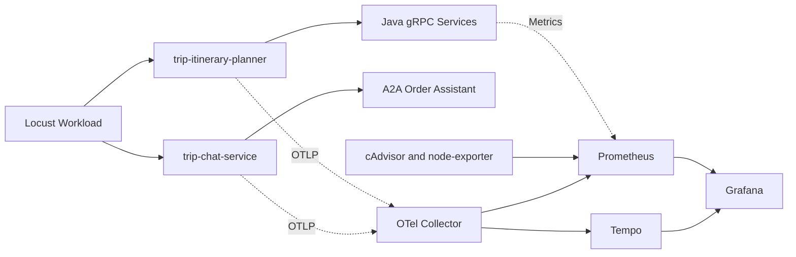

# Locust 故障压测与 Metrics 采集设计

> 目标：在已落地的应用层故障注入框架上，使用 Locust 构造高/低压力与故障/无故障四象限实验，采集端到端可用性、延迟、Fallback、Trace、容器资源与系统资源指标，形成可复现的鲁棒性评估流程。

## 1. 当前结论

当前仓库已经基本完成“可复现的应用层故障注入”闭环，足以作为 Locust 压测实验的前置能力：

- `docs/fault-injection-quickstart.md` 已说明全局开关、请求头 DSL、已接入 target、手工验证与回滚方式。
- `trip-itinerary-planner/src/itinerary_planner/observability/fault.py` 与 `trip-chat-service/src/chat/observability/fault.py` 已实现 `FaultRegistry`、场景解析、请求上下文匹配、概率门、延迟/异常/gRPC 错误/响应篡改/状态清空/路由扰动/Agent drop 等原语。
- `docker-compose.yaml` 已为 `trip-itinerary-planner` 与 `trip-chat-service` 透传 `FAULT_INJECTION_ENABLED`、`FAULT_INJECTION_SCENARIO`、`FAULT_INJECTION_FILE`，可以在容器启动时启用注入能力。
- `scripts/fault-demo.sh` 已覆盖链路 A 的 14 个单请求故障 demo，并打印 `experiment.id`、HTTP 状态和请求耗时，便于在 Tempo 中检索 `fault.injected=true` 的 trace。
- 注入命中会写入 `fault.*` 与 `experiment.id` Span 属性，可与 Tempo TraceQL 串联“实验声明 -> 注入命中 -> 系统响应”。

但压测级 metrics 还没有完全闭环：

- `infra/prometheus/prometheus.yaml` 当前只抓 Prometheus 自身和 OTel Collector，没有抓 Docker 容器、宿主机、Java 服务 Actuator 或 Python 应用自定义 `/metrics`。
- `infra/otel-collector/config.yaml` 已接收 traces/metrics/logs 并导出到 Tempo/Prometheus，但还没有配置 `spanmetrics` connector，因此 `fault.injected=true`、入口 Span 延迟等 Trace 维度还不能直接转为 Prometheus 时间序列。
- `scripts/fault-demo.sh` 是故障演示脚本，不是压测脚本。Locust 需要独立脚本来控制用户数、RPS、实验窗口和四象限标签。

所以判断是：**故障注入能力已经可以复现实验场景；系统/容器 metrics 与自动化压测编排仍需补齐。**

## 2. 实验目标

Locust 方案不是单纯“打满系统”，而是用可控负载验证同一系统在不同环境压力和故障条件下的退化曲线：

1. 建立无故障低压/高压 baseline，得到 TripSphere 在正常情况下的吞吐、延迟、错误率和资源消耗。
2. 在相同低压/高压下开启同一组故障，观察成功率、p95/p99、Fallback 触发率、资源消耗和恢复表现相对 baseline 的偏移。
3. 用 `experiment.id` 串联 Locust CSV、Prometheus 时间窗口和 Tempo trace，保证每次实验可复查、可复跑、可对比。
4. 输出论文/报告可用的实验表格：四象限结果、典型 trace、PromQL/TraceQL 查询、结论与改进建议。

## 3. 四象限实验矩阵

| 象限 | 实验名 | 压力 | 故障 | 主要用途 |
|------|--------|------|------|----------|
| Q1 | `baseline-low` | 低压 | 不注入 | 正常稳态基线，验证低负载下系统本身是否健康 |
| Q2 | `fault-low` | 低压 | 注入 | 排除资源瓶颈后观察故障本身造成的业务退化 |
| Q3 | `baseline-high` | 高压 | 不注入 | 观察正常系统在高并发下的容量上限和资源瓶颈 |
| Q4 | `fault-high` | 高压 | 注入 | 验证“高压 + 故障”叠加时是否出现级联失败 |

推荐先以链路 A `POST /api/v1/itineraries/plannings` 作为主场景，因为它同时覆盖 FastAPI、LangGraph workflow、LLM、高德 HTTP、Java gRPC 微服务和持久化 RPC，且已有 `scripts/fault-demo.sh` 可作为场景参考。

### 3.1 负载档位

初始值建议保守，先用本地机器校准，避免把宿主机性能瓶颈误判为应用鲁棒性问题。

| 档位 | Locust users | spawn rate | 目标 RPS | 持续时间 | 用途 |
|------|--------------|------------|----------|----------|------|
| 预热 | 2 | 1/s | 不固定 | 3-5 min | 预热 LLM 连接、Nacos 发现、JIT/缓存 |
| 低压 | 5-10 | 1-2/s | 1-5 RPS | 15-30 min | 稳态对照与故障可见性验证 |
| 高压 | 50-100 | 5-10/s | 20-50 RPS | 15-30 min | 容量、排队、超时和资源瓶颈观察 |
| 恢复 | 5 | 1/s | 1-3 RPS | 10-15 min | 故障关闭后确认指标回落 |

如果 LLM 网关或本地机器无法承受上述高压，优先保持四象限结构不变，降低 users/RPS，并在实验记录中写明校准后的档位。

### 3.2 命名规范

每次实验使用稳定前缀，便于跨系统关联：

```text
experiment_id = locust-{matrix}-{fault}-{yyyyMMddHHmm}

示例：
locust-baseline-low-none-202604271330
locust-fault-low-geocode-latency-202604271400
locust-baseline-high-none-202604271430
locust-fault-high-geocode-latency-202604271500
```

Locust 每个请求可以在此基础上追加短后缀，例如 `locust-fault-low-geocode-latency-202604271400-r000123`，但 Prometheus/Tempo 聚合建议保留共同前缀或额外写入 `matrix`、`fault_case` 标签。

## 4. Locust 脚本设计

建议新增独立脚本而不是扩展 `scripts/fault-demo.sh`。脚本应支持命令行或环境变量控制以下参数：

| 参数 | 示例 | 说明 |
|------|------|------|
| `TARGET_HOST` | `http://localhost:24215` | planner HTTP 地址 |
| `EXPERIMENT_ID` | `locust-fault-low-geocode-latency-...` | 本轮实验主键 |
| `FAULT_SCENARIO` | `tool.geocoding.latency=4000` | 空字符串表示不注入 |
| `USER_ID` | `42` | 请求头 `x-user-id` |
| `PAYLOAD_MODE` | `fixed` / `mixed` | 固定目的地或多目的地随机 |
| `MATRIX_CELL` | `baseline-low` | 四象限标签，写入 Locust 输出文件名 |

主请求模板：

```http
POST /api/v1/itineraries/plannings
Content-Type: application/json
x-user-id: 42
x-experiment-id: locust-fault-low-geocode-latency-202604271400
x-fault-scenario: tool.geocoding.latency=4000
```

无故障组仍建议保留 `x-experiment-id`，但不传或传空 `x-fault-scenario`。这样 baseline trace 也能按实验窗口检索。

### 4.1 首批故障场景

首轮不需要覆盖所有 DSL，先选择链路 A 中最能体现系统退化差异的代表故障：

| 故障名 | `x-fault-scenario` | 预期行为 | 适合象限 |
|--------|--------------------|----------|----------|
| `geocode-latency` | `tool.geocoding.latency=4000` | 成功率大体不变，端到端延迟上升，默认坐标 fallback 可能出现 | Q2/Q4 |
| `attraction-exception` | `rpc.attraction.GetAttractionsNearby.exception=RuntimeError,message=injected_attr_down` | HTTP 仍可能成功，但景点候选为空，生成质量下降 | Q2/Q4 |
| `itinerary-unavailable-10p` | `rpc.itinerary.create.error=UNAVAILABLE,probability=0.1` | 约 10% 请求持久化失败，HTTP 502 上升 | Q2/Q4 |
| `cascade-degrade` | `tool.geocoding.latency=3000;rpc.attraction.GetAttractionsNearby.exception=RuntimeError` | 延迟与内容质量同时退化，观察高压下是否级联 | Q4 |

### 4.2 单故障 vs 组合故障

实验分两个阶段推进：

**阶段一：单故障归因（`single` 模式）**

每轮只激活一个主变量，`probability` 可以是 1.0（确定触发）或小于 1.0（间歇触发）。组合故障留到单点结果稳定之后再跑，避免归因混淆。

**阶段二：组合故障压力（`combo` 模式）**

多个故障同时写入 `x-fault-scenario`，每条故障独立设置 `probability`，服务端 `FaultRegistry` 对每条 fault 各自独立抽样决定是否命中，不存在客户端预先随机。这意味着同一请求可能命中零个、一个或多个故障。

```text
# 示例：combo 场景 cascade_degrade 的 DSL
tool.geocoding.latency=3000,probability=0.3;rpc.attraction.GetAttractionsNearby.exception=RuntimeError,message=injected_attr_down,probability=0.2
```

**重要：命中统计区分**

- Locust 侧 `quality.csv` 记录"声明的 DSL 和请求结果"，不等于故障实际命中次数。
- 实际命中次数以 Tempo 中 `fault.injected=true` 为准，通过 TraceQL 聚合。
- 在实验记录模板中，`fault_dsl`（声明）和 `fault_injected_count`（Tempo 查询结果）必须分开填写。

### 4.3 脚本文件

| 文件 | 说明 |
|------|------|
| `scripts/locust/fault_scenarios.yaml` | 场景配置，定义 single/combo 下各场景的故障条目和概率 |
| `scripts/locust/locustfile.py` | Locust 用户脚本，读取场景 YAML 拼接 DSL，发送请求并写 `quality.csv` |
| `scripts/locust/pyproject.toml` | `locust` 与 `pyyaml` 依赖，供 `uv run` 使用 |
| `scripts/locust/run-matrix.sh` | 单象限或全矩阵执行入口 |

## 5. Metrics 分层

### 5.1 Locust 指标

Locust 自带指标是四象限对比的第一层：

| 指标 | 含义 | 判读方式 |
|------|------|----------|
| `requests/s` | 实际吞吐 | 高压组是否达到目标，故障组是否吞吐下降 |
| `failures/s` | 失败速率 | 与 HTTP 5xx、超时、连接错误关联 |
| `p50/p95/p99` | 端到端延迟 | 故障注入是否按预期放大延迟 |
| `avg response time` | 平均延迟 | 粗看整体退化，不替代 p95/p99 |
| `response length` | 响应体长度 | 景点/酒店清空时可能下降，可作为质量退化侧信号 |

Locust 输出建议保存为：

```text
artifacts/locust/{experiment_id}/stats.csv
artifacts/locust/{experiment_id}/failures.csv
artifacts/locust/{experiment_id}/exceptions.csv
artifacts/locust/{experiment_id}/run.log
```

### 5.2 Trace 指标

Trace 用于确认“故障是否真的命中”和“命中后走了哪条路径”。

推荐 TraceQL：

```traceql
{ resource.service.name = "trip-itinerary-planner" && .experiment.id = "locust-fault-low-geocode-latency-202604271400" }
```

```traceql
{ resource.service.name = "trip-itinerary-planner" && .experiment.id = "locust-fault-low-geocode-latency-202604271400" && .fault.injected = true }
```

重点观察：

| Span 属性 | 用途 |
|-----------|------|
| `experiment.id` | 实验主键 |
| `fault.scenario` | 请求声明的故障 |
| `fault.injected` | 是否实际注入 |
| `fault.target` | 命中的注入点 |
| `fault.primitive` | latency / exception / error / mutate 等 |
| `fault.outcome` | delayed / raised / mutated / bypassed 等 |
| `rpc.service` / `rpc.method` | 下游服务维度 |
| `tool.outcome` / `tool.fallback_reason` | 工具 fallback 与拒绝路径 |

### 5.3 Prometheus 指标

当前 Prometheus 已经可以抓 OTel Collector 暴露的 metrics，但要完成压测实验，建议补齐以下 scrape 面：

| 层级 | 推荐组件 | 指标例子 | 用途 |
|------|----------|----------|------|
| 宿主机 | node-exporter | CPU、内存、磁盘 IO、网络 IO | 判断是否宿主机打满 |
| Docker 容器 | cAdvisor | 每容器 CPU、内存、网络、重启 | 定位 planner/chat/Java/LLM gateway 哪个容器瓶颈 |
| Trace 转指标 | OTel spanmetrics connector | 请求延迟、Span 计数、错误计数 | 将 `fault.*`、`experiment.id` 聚合成时间序列 |
| Java 服务 | Spring Actuator Prometheus | JVM、线程池、HTTP/gRPC 相关指标 | 判断 Java 微服务是否成为瓶颈 |
| Python 应用 | OpenTelemetry metrics 或自定义 `/metrics` | in-flight、fallback counter、故障命中 counter | 补充业务语义指标 |

首批 PromQL 口径可设计为：

```promql
rate(container_cpu_usage_seconds_total{name=~"trip-itinerary-planner|trip-attraction-service|trip-itinerary-service"}[1m])
```

```promql
container_memory_working_set_bytes{name=~"trip-itinerary-planner|trip-attraction-service|trip-itinerary-service"}
```

```promql
rate(container_network_receive_bytes_total{name="trip-itinerary-planner"}[1m])
```

```promql
histogram_quantile(0.95, sum by (le, service_name) (rate(traces_spanmetrics_latency_bucket[5m])))
```

最后一条依赖后续接入 spanmetrics，名称需以实际 OTel Collector 输出为准。

### 5.4 业务质量指标

对 AI 原生链路，只看 HTTP 2xx 不够。建议额外记录：

| 指标 | 获取方式 | 说明 |
|------|----------|------|
| `itinerary_saved_rate` | HTTP 201 且响应含 `id` | 持久化成功率 |
| `day_plan_count` | 解析响应 JSON | 行程是否退化为空骨架 |
| `activity_count` | 解析响应 JSON | 景点/住宿活动是否缺失 |
| `markdown_length` | 响应 `markdown_content` 长度 | 粗略衡量生成内容退化 |
| `fallback_rate` | Trace `tool.fallback_reason` 或响应结构 | 观察容错是否按预期触发 |

这些指标可以先由 Locust 脚本在响应钩子里写 CSV，后续再沉淀为 Prometheus metrics。

## 6. 数据采集架构



数据关联以 `experiment.id` 为主线：

1. Locust 输出目录以 `experiment_id` 命名。
2. HTTP 请求头写入 `x-experiment-id`。
3. OTel Span 写入 `experiment.id`。
4. Prometheus 查询使用实验开始/结束时间窗口过滤。
5. 实验记录保存 Locust 命令、故障 DSL、时间窗口、PromQL、TraceQL 和典型 trace id。

## 7. 运行命令参考

### 7.1 安装依赖

仓库使用 `uv`，首次运行会自动在 `scripts/locust/` 的虚拟环境中下载 `locust` 和 `pyyaml`，无需手动安装。

```bash
# 确认 uv 版本
uv --version

# 可选：预先同步依赖（也可跳过，run-matrix.sh 内部会执行）
uv sync --project scripts/locust
```

### 7.2 启用故障注入

```bash
export FAULT_INJECTION_ENABLED=true
task start   # 重启容器使环境变量生效
docker logs trip-itinerary-planner | grep "fault injection enabled"
```

### 7.3 单象限运行

```bash
# Q1 — baseline-low：低压、不注入故障
bash scripts/locust/run-matrix.sh baseline-low "" 10 2 15m

# Q2 — fault-low：低压、geocoding 4s 延迟（100% 概率）
bash scripts/locust/run-matrix.sh fault-low geocode_latency 10 2 15m

# Q3 — baseline-high：高压、不注入故障
bash scripts/locust/run-matrix.sh baseline-high "" 50 5 15m

# Q4 — fault-high：高压、geocoding 延迟（100% 概率）
bash scripts/locust/run-matrix.sh fault-high geocode_latency 50 5 15m

# Q4 — fault-high：高压、组合故障（combo 模式）
SCENARIO_MODE=combo bash scripts/locust/run-matrix.sh fault-high cascade_degrade 50 5 15m combo
```

### 7.4 全矩阵一键运行

```bash
# 用 geocode_latency 故障跑完 4 个象限（每个象限 15 分钟）
bash scripts/locust/run-matrix.sh all geocode_latency 10 50 15m

# 用 combo 模式跑全矩阵
SCENARIO_MODE=combo bash scripts/locust/run-matrix.sh all cascade_degrade 10 50 15m
```

脚本执行结束后会打印每个象限的 Tempo TraceQL 查询语句，便于直接粘贴到 Grafana。

### 7.5 输出文件

每次运行在 `artifacts/locust/{experiment_id}/` 下生成：

| 文件 | 来源 | 内容 |
|------|------|------|
| `stats_stats.csv` | Locust | 每个请求组的聚合吞吐/延迟/失败统计 |
| `stats_failures.csv` | Locust | 失败请求明细 |
| `stats_exceptions.csv` | Locust | Python 异常明细 |
| `report.html` | Locust | 可视化报告 |
| `quality.csv` | locustfile.py | 每请求业务质量指标：request_id、状态码、延迟、day_plan_count、activity_count、markdown_length 等 |
| `run.log` | Locust | 日志 |
| `console.log` | tee | 控制台输出全量记录 |

`quality.csv` 与 `stats_stats.csv` 的关联：`quality.csv` 的 `experiment_id` 与 Prometheus 时间窗口、Tempo trace 共享同一实验主键，三者可以对齐。

## 8. 执行流程

每个故障主变量按同一节奏执行，保证可比性：

1. 确认 `FAULT_INJECTION_ENABLED=true` 已在目标容器内生效。
2. 启动 Prometheus、Tempo、Grafana，并确认采集目标 healthy。
3. 运行预热档位 3-5 分钟，不纳入统计。
4. 执行 `baseline-low`，保存 Locust CSV 与时间窗口。
5. 执行 `fault-low`，同样的负载参数，只增加 `x-fault-scenario`。
6. 执行恢复窗口，确认错误率/延迟回落。
7. 执行 `baseline-high`。
8. 执行 `fault-high`。
9. 导出四象限 Locust CSV、Prometheus 查询结果、典型 Tempo trace。
10. 填写实验记录模板，给出结论与后续改进。

建议四个象限不要交叉运行，避免同一组容器资源互相污染。高压实验前后都保留恢复窗口，尤其是涉及 LLM、数据库、Nacos 或 gRPC 连接池时。

## 9. 实验记录模板

```yaml
experiment:
  id: "locust-fault-low-geocode-latency-202604271400"
  matrix_cell: "fault-low"           # baseline-low | fault-low | baseline-high | fault-high
  scenario_name: "geocode_latency"   # fault_scenarios.yaml 中的场景名
  scenario_mode: "single"            # single | combo
  fault_dsl: "tool.geocoding.latency=4000,probability=1.0"  # 声明的 DSL（Locust 透传）
  target_chain: "A"
  endpoint: "POST /api/v1/itineraries/plannings"
  hypothesis: "低压下高德 4s 延迟会显著提高 p95，但不应明显降低成功率。"
  seed: 42
load:
  users: 10
  spawn_rate: 2
  duration: "30m"
  target_rps: "1-5"
windows:
  warmup: "13:55-14:00"
  measure: "14:00-14:30"
  recovery: "14:30-14:45"
locust:
  artifact_dir: "artifacts/locust/locust-fault-low-geocode-latency-202604271400/"
  total_requests: 0
  failure_rate: 0
  p50_ms: 0
  p95_ms: 0
  p99_ms: 0
quality_csv:
  # 从 quality.csv 聚合得到（non-baseline 组才有意义）
  median_day_plan_count: 0
  median_activity_count: 0
  median_markdown_length: 0
  itinerary_saved_rate: 0
trace_evidence:
  # 声明概率 vs 实际命中数：必须分开记录
  declared_fault_dsl: "tool.geocoding.latency=4000,probability=1.0"
  fault_injected_count: 0   # Tempo 查询 fault.injected=true 的 Span 数，补充 Locust 总请求数
  traceql_all: >
    { resource.service.name = "trip-itinerary-planner"
      && .experiment.id = "locust-fault-low-geocode-latency-202604271400" }
  traceql_fault: >
    { resource.service.name = "trip-itinerary-planner"
      && .experiment.id = "locust-fault-low-geocode-latency-202604271400"
      && .fault.injected = true }
  representative_trace_ids: []
prometheus:
  promql:
    - "rate(container_cpu_usage_seconds_total{name=\"trip-itinerary-planner\"}[1m])"
    - "container_memory_working_set_bytes{name=\"trip-itinerary-planner\"}"
conclusion: ""
follow_up: []
```

## 10. 后续落地步骤

已完成：

- `scripts/locust/fault_scenarios.yaml`：场景配置，定义 single/combo 场景与每故障概率。
- `scripts/locust/locustfile.py`：Locust 用户脚本，发送链路 A 规划请求，注入实验头，解析响应质量，写 `quality.csv`。
- `scripts/locust/pyproject.toml`：`locust`/`pyyaml` 依赖，供 `uv run` 使用。
- `scripts/locust/run-matrix.sh`：四象限执行入口，支持单象限和全矩阵（`all`）模式。

尚待实现：

1. 在 `docker-compose.yaml` 增加 cAdvisor 与 node-exporter，或单独提供 `docker-compose.metrics.yaml`，避免默认开发环境过重。
2. 扩展 `infra/prometheus/prometheus.yaml`，新增 cAdvisor/node-exporter scrape job；如 Java 服务开放 Actuator，也加入对应 scrape job。
3. 扩展 `infra/otel-collector/config.yaml`，增加 `connector/spanmetrics`，把入口 Span、RPC Span、`fault.injected`、`fault.target` 等维度转为 Prometheus 指标，使 `fault_injected_count` 可以直接查 Prometheus 而不必每次跑 TraceQL。
4. 建立 Grafana dashboard：四象限 Locust 结果、容器 CPU/内存/网络、Trace p95/p99、错误率、故障命中计数、Fallback 触发率。
5. 固化实验记录目录，例如 `experiments/locust-fault-metrics/{experiment_id}.yaml`，保证每次实验配置和结果可以复查。

## 11. 判断标准

这套方案完成后，一次合格实验至少应满足：

- 四象限都能用同一个 Locust 脚本复跑，只通过参数改变负载与故障。
- 故障象限中 Tempo 能查到 `fault.injected=true` 的代表 trace。
- baseline 与 fault 的 Locust p95、失败率、吞吐有清晰对比。
- Prometheus 能看到目标容器和宿主机资源曲线，避免误判瓶颈来源。
- 实验记录包含 `experiment.id`、时间窗口、负载参数、故障 DSL、PromQL/TraceQL 和结论。

